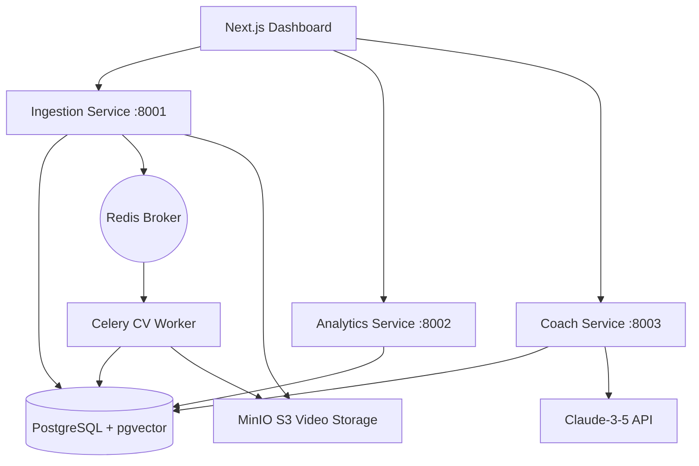

# Badminton Performance Analytics System

A comprehensive descriptive, predictive, and prescriptive analytics platform for badminton, mapping raw video to post-match tactical coaching recommendations.

## System Architecture



The system comprises 5 main components:
1. **Ingestion Service (`ingest_svc`)**: Manages video metadata, schedules CV extraction tasks, and generates secure S3 upload pre-signed URLs.
2. **Computer Vision Worker (`cv_worker`)**: A Celery worker running TrackNetV3 (shuttle tracking), YOLOv8 (player detection), MMPose (pose extraction), and BST (stroke type classification) sequentially with memory protection checks (<3.5GB VRAM threshold, CPU fallback).
3. **Analytics Service (`analytics_svc`)**: Aggregates descriptive stats (reaction times, heatmaps, distances covered) and runs XGBoost (win probability) + PyTorch LSTM (next-shot prediction) with sub-10ms latency.
4. **Coaching Service (`coach_svc`)**: Evaluates deterministic rules (net-front underuse, momentum swings) and calls Claude-3.5 Sonnet to generate structured tactical recommendations.
5. **Web Dashboard (`frontend/`)**: Next.js 14 application displaying court heatmaps, rally timelines synced with video, comparison radars, and AI coaching feeds.

---

## Local Development Setup

### Backend (Python 3.11+)

1. Navigate to the backend directory:
   ```bash
   cd backend
   ```
2. Create and activate a virtual environment:
   ```bash
   python -m venv .venv
   .venv\Scripts\activate      # Windows
   source .venv/bin/activate    # macOS/Linux
   ```
3. Install dependencies using `uv` or `pip`:
   ```bash
   pip install -e .
   pip install pytest pytest-cov pytest-asyncio
   # OR: uv pip install -e .
   ```
4. Seed the ShuttleSet dataset into the local database:
   ```bash
   python ml/data/ingest_shuttleset.py
   ```
5. Run the test suite:
   ```bash
   python -m pytest
   ```

### Frontend (Next.js)

1. Navigate to the frontend directory:
   ```bash
   cd frontend
   ```
2. Install npm dependencies:
   ```bash
   npm install
   ```
3. Run the development server:
   ```bash
   npm run dev
   ```
4. Verify production compilation succeeds:
   ```bash
   npm run build
   ```

---

## Docker Production Deployment

To spin up the entire application stack in production mode, run:
```bash
docker compose -f docker-compose.prod.yml up --build -d
```

This starts:
- **db**: PostgreSQL 16 with the `pgvector` extension for rally similarity indexing.
- **redis**: Redis 7 for task queuing and response caching.
- **object-store**: MinIO for local S3 simulation.
- **ingest-svc**: Running on port `8001`.
- **analytics-svc**: Running on port `8002`.
- **coach-svc**: Running on port `8003`.
- **cv-worker**: CPU fallback-enabled Celery task runner.
- **web**: Next.js dashboard running on port `3000`.

---

## Key Performance & Security Features

- **Database Query Optimization**: Configured explicit indexes on key foreign columns:
  - `idx_matches_player_a` / `idx_matches_player_b` on `matches`
  - `idx_sets_match` / `idx_sets_winner` on `sets`
  - `idx_rallies_server` / `idx_rallies_winner` on `rallies`
- **Rate Limiting**: Integrated sliding-window client rate limits (30 requests/min max) using Redis cache with an in-memory thread-safe fallback.
- **Security Checkpoints**: Built-in JSON request body payload size checks (max 1MB) to guard ingestion routes against Denial of Service (DoS) exploits.
- **VRAM Mitigation**: Model inference pipelines optimized for sequentially clearing PyTorch GPU caches between processing stages and supporting a `FORCE_CPU=true` mode for machines under 8GB VRAM (e.g., RTX 3050 Laptop GPUs).
